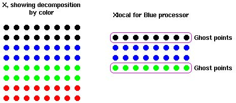

# Examen final

## Ejercicio 1

### Descripción

Cree una estructura de datos paralela. Esta es una malla de puntos dividida en bloques, cada bloque debe de estar asignado a un procesador diferente. De forma simple en C, la estructura de datos completa sería:
```
double x[ maxn ][ maxn ];
```
Y lo queremos acomodar de manera que cada procesador tenga su fracción local:
```
double xlocal [ maxn ][ maxn / size ];
```
donde “size” es el tama˜no del comunicador global(es decir, la cantidad de procesos levantados).
Para la computación que vamos a realizar en esta estructura de datos, necesitaremos valores adyacentes. Es decir, para computar un nuevo x[i][j], vamos a necesitar:
```
x[i][j + 1]
x[i][j − 1]
x[i + 1][j]
x[i − 1][j]
```
Algunos de estos podrían ser un problema si no están en xlocal sino que están en el procesador adyacente. Para manejar estos casos, definiremos puntos “fantasma” que van a contener los valores de estos puntos adyacentes.

Escriba código que divida el array x en partes iguales y copie los bordes adyacentes a los procesadores vecinos. Asuma que x es de tamaño maxn x maxn y que maxn es divisible entre el número de procesadores. Por simplicidad, puede asumir un array de tamaño fijo y un número fijo de procesadores (indicarlo en documentación interna del código).

Para probar su solución, cada procesador debe de llenar su sección con el rank del proceso, y los puntos fantasma con -1. Luego de que el intercambio se lleve a cabo, revise que los puntos fantasma tengan el valor adecuado. **IMPORTANTE**: Asuma que el dominio NO es periódico. Es decir, el rank “0” no le tiene que enviar datos al rank “size - 1” ni viceversa.

En la siguiente imagen se muestra un ejemplo con maxn = 8 y 4 procesadores:




### Compilación y Ejecución

Para compilar el programa utilizar `make ejercicio1` o usar directamente el siguiente comando:
```
mpicc ./Ejercicio1/ejercicio_1.c -g -O3 -o ./Ejercicio1/ejercicio_1
```

Para ejecutar el programa utilizar `make run1` o usar directamente el siguiente comando de ejemplo:
```
mpirun -np 4 ./Ejercicio1/ejercicio_1
```


## Ejercicio 2

### Descripción

Paralelice el método de monte carlo para calcular π que se encuentra en mediación virtual, llamado Monte Carlo.

Se proveen 3 archivos para este problema:
* pi mc.c que es el m´etodo monte carlo para calcular pi
* random.c que es un generador de números pseudo aleatorios
* random.h headers del random.c

Cree una versión paralela con OpenMP de este programa sin cambiar las interfaces de llamados a funciones en random.c


### Compilación y Ejecución

Para compilar el programa utilizar `make ejercicio2` o usar directamente el siguiente comando:
```
gcc ./Ejercicio2/random.h ./Ejercicio2/pi_mc.c ./Ejercicio2/random.c -fopenmp -g -O3 -o ./Ejercicio2/pi_mc
```

Para ejecutar el programa utilizar `make run2` o usar directamente el siguiente comando de ejemplo:
```
./Ejercicio2/pi_mc
```


## Ejercicio 3

### Descripción

Paralelice el programa que se encuentra en mediación virtual, llamado CUDA loops, utilizando CUDA.

Cree una función que duplique cada uno de los elementos del array a de forma paralela (ver el comentario en el código), cada hilo debe de trabajar sobre más de un elemento. No cambie el N ni el tamaño del grid de hilos.


### Compilación y Ejecución

Para compilar el programa utilizar `make ejercicio3` o usar directamente el siguiente comando:
```
nvcc ./Ejercicio3/loop-stride.cu -arch=compute_35 -g -O3 -o ./Ejercicio3/loop-stride
```

Para ejecutar el programa utilizar `make run3` o usar directamente el siguiente comando de ejemplo:
```
./Ejercicio3/loop-stride
```


## **Nota**
Las ejecuciones de los ejercicios se llevaron a cabo en el [Clúster Kabré](https://kabre.cenat.ac.cr/) del Colaboratorio Nacional de Computación Avanzada | [CeNAT](https://www.cenat.ac.cr/en/).

Para utilizar el Nodo que cuenta con GPU y para cargar los módulos necesarios se ejecutaron los siguientes comandos:
```

srun --partition=nukwa --pty --preserve-env $SHELL

module load gcc/9.3.0

module load cuda/11.1

module load mpich/4.1.1

```


## Créditos
Desarrollado por **Manuel Morales Chaves**.  
<manuel.moraleschaves@ucr.ac.cr>
\
\
Recursos consultados/utilizados:
- [MPI Forum](https://www.mpi-forum.org/).
- [OpenMP](https://www.openmp.org/).
- [Introduction to CUDA Programming](https://raw.githubusercontent.com/ULHPC/tutorials/devel/gpu/cuda2023/cuda2023.pdf)
- [Guía de Usuario - Kabré](https://kabre.cenat.ac.cr/guia-usuario/)
