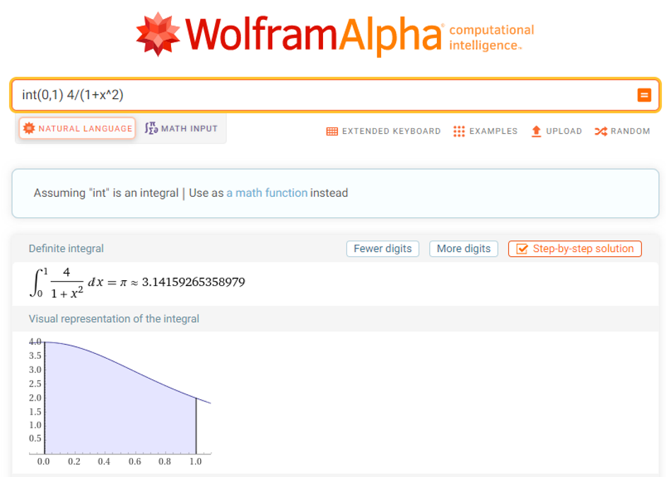
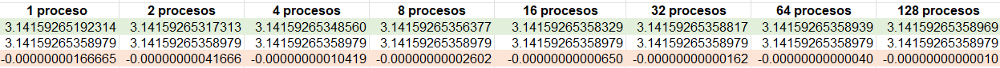

# Tarea1: Aproximar PI con la regla de los trapecios aplicando weak scaling
 
## Descripción del problema

Vamos a aplicar weak scaling al problema de aproximar pi con el método de los trapecios.

```
f(x) = 4/(1+x^2) (integrar en el dominio de 0 a 1)
```

Deben asignar una cantidad fija de trapecios que calcular a cada proceso (10000 trapecios por proceso).

Con un proceso, vamos a tener 10k trapecios, con 2, tenemos 20k trapecios, etc...

Una vez que se ha implementado el programa. Ejecútelo con 1 proceso, 2 procesos, 4 procesos, 8 procesos y 16 procesos. Observe
la diferencia entre la calidad de la aproximación que se hace con más trapecios al aumentar la cantidad de procesos.


## Resultados

### 1 proceso
```

[curso-726@nu-0a Tarea1]$ mpirun -np 1 ./Pi_Trapezoidal

Calculating PI with 10000 trapezoids and 1 process(es)...

Approximation of PI: 3.14159265192314

Program finished...

```

### 2 procesos
```

[curso-726@nu-0a Tarea1]$ mpirun -np 2 ./Pi_Trapezoidal

Calculating PI with 20000 trapezoids and 2 process(es)...

Approximation of PI: 3.14159265317312

Program finished...

```

### 4 procesos
```

[curso-726@nu-0a Tarea1]$ mpirun -np 4 ./Pi_Trapezoidal

Calculating PI with 40000 trapezoids and 4 process(es)...

Approximation of PI: 3.14159265348563

Program finished...

```

### 8 procesos
```

[curso-726@nu-0a Tarea1]$ mpirun -np 8 ./Pi_Trapezoidal

Calculating PI with 80000 trapezoids and 8 process(es)...

Approximation of PI: 3.14159265356375

Program finished...

```

### 16 procesos
```

[curso-726@nu-0a Tarea1]$ mpirun -np 16 ./Pi_Trapezoidal

Calculating PI with 160000 trapezoids and 16 process(es)...

Approximation of PI: 3.14159265358328

Program finished...

```


## Análisis
De los resultados obtenidos en esas ejecuciones, se puede observar que conforme se aumenta el número de procesos (y por ende la cantidad de trapecios utilizados para el cálculo), la aproximación de PI se vuelve más cercana al valor mostrado en la página web [WolframAlpha](https://www.wolframalpha.com/input?i=int%280%2C1%29+4%2F%281%2Bx%5E2%29):



En la siguiente imagen se muestra una pequeña comparativa de los resultados de las ejecuciones vs el valor de **WolframAlpha**:



En verde se encuentra el resultado del sistemita desarrollado, en blanco el resultado esperado y en anaranjado la diferencia de esos dos valores. Se puede apreciar que entre mayor sea el número de procesos, más se acerca a 0 la diferencia entre la aproximación realizada con la regla de los trapecios y con weak scaling y el valor esperado.


## Créditos
Desarrollado por **Manuel Morales Chaves**.  
<manuel.moraleschaves@ucr.ac.cr>
\
\
Recursos consultados/utilizados:
- [Aproximación de integrales](https://multimedia.uned.ac.cr/pem/metodos_numericos_ensenanza/modulo4/descripcion.html).
