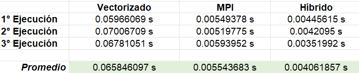
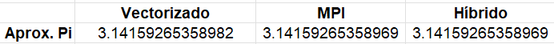

# Tarea2: Vectorización
 
## Descripción de la Tarea

Tome el código de la tarea 1 y paralelícelo utilizando vectorización.
Debe entregar el código y un documento donde hace tres comparaciones de tiempo de ejecución TOTAL con:


- Código únicamente con vectorización

- Código únicamente con MPI

- Código con ambos


## Compilación y Ejecución

### Código Vectorizado
Para compilar el programa utilizar `make Pi_Trapezoidal_Vec` o usar directamente el siguiente comando:
```
g++ timer.h Pi_Trapezoidal_Vec.cpp timer.c -g -O3 -fstrict-aliasing -ftree-vectorize -march=native -mtune=native -fopt-info-vec-optimized -ftree-vectorizer-verbose=3 -fopt-info-vec -o Pi_Trapezoidal_Vec
```

Para ejecutar el programa utilizar:
```
./Pi_Trapezoidal_Vec 1280000
```

### Código MPI
Para compilar el programa utilizar `make Pi_Trapezoidal_Mpi` o usar directamente el siguiente comando:
```
mpic++ timer.h Pi_Trapezoidal_Mpi.cpp timer.c -o Pi_Trapezoidal_Mpi
```

Para ejecutar el programa utilizar:
```
mpiexec -np 128 ./Pi_Trapezoidal_Mpi
```

### Código Híbrido
Para compilar el programa utilizar `make Pi_Trapezoidal_Hyb` o usar directamente el siguiente comando:
```
mpic++ timer.h Pi_Trapezoidal_Hyb.cpp timer.c -g -O3 -fstrict-aliasing -ftree-vectorize -march=native -mtune=native -fopt-info-vec-optimized -ftree-vectorizer-verbose=3 -fopt-info-vec -o Pi_Trapezoidal_Hyb
```

Para ejecutar el programa utilizar:
```
mpiexec -np 128 ./Pi_Trapezoidal_Hyb
```


## Resultados
En la [Tarea 1](../01_pi_trapezoidal/README.md) se identificó que la mejor aproximación de Pi se logró con 128 procesos (1.280.000 trapecios), por lo que se utilizó esa misma cantidad para ejecutar los programas.

Asimismo, con el fin de obtener un promedio del tiempo de ejecución de los programas, cada uno de ellos se puso a correr 3 veces y estos fueron los resultados obtenidos:

### Código Vectorizado
Primera ejecución:
```

[curso-726@nu-0a Tarea2]$ ./Pi_Trapezoidal_Vec 1280000

Calculating PI with 1280000 trapezoids using Vectorization...

Approximation of PI: 3.14159265358982

Program finished in 0.05966069 secs ...

```

Segunda ejecución:
```

[curso-726@nu-0a Tarea2]$ ./Pi_Trapezoidal_Vec 1280000

Calculating PI with 1280000 trapezoids using Vectorization...

Approximation of PI: 3.14159265358982

Program finished in 0.07006709 secs ...

```

Tercera ejecución:
```

[curso-726@nu-0a Tarea2]$ ./Pi_Trapezoidal_Vec 1280000

Calculating PI with 1280000 trapezoids using Vectorization...

Approximation of PI: 3.14159265358982

Program finished in 0.06781051 secs ...

```

### Código MPI
Primera ejecución:
```

[curso-726@nu-0a Tarea2]$ mpiexec -np 128 ./Pi_Trapezoidal_Mpi

Calculating PI with 1280000 trapezoids and 128 process(es) using MPI...

Approximation of PI: 3.14159265358969

Program finished in 0.00549378 secs ...

```

Segunda ejecución:
```

[curso-726@nu-0a Tarea2]$ mpiexec -np 128 ./Pi_Trapezoidal_Mpi

Calculating PI with 1280000 trapezoids and 128 process(es) using MPI...

Approximation of PI: 3.14159265358969

Program finished in 0.00519775 secs ...

```

Tercera ejecución:
```

[curso-726@nu-0a Tarea2]$ mpiexec -np 128 ./Pi_Trapezoidal_Mpi

Calculating PI with 1280000 trapezoids and 128 process(es) using MPI...

Approximation of PI: 3.14159265358969

Program finished in 0.00593952 secs ...

```

### Código Híbrido
Primera ejecución:
```

[curso-726@nu-0a Tarea2]$ mpiexec -np 128 ./Pi_Trapezoidal_Hyb

Calculating PI with 1280000 trapezoids and 128 process(es) using MPI + Vectorization...

Approximation of PI: 3.14159265358969

Program finished in 0.00445615 secs ...

```

Segunda ejecución:
```

[curso-726@nu-0a Tarea2]$ mpiexec -np 128 ./Pi_Trapezoidal_Hyb

Calculating PI with 1280000 trapezoids and 128 process(es) using MPI + Vectorization...

Approximation of PI: 3.14159265358969

Program finished in 0.00420950 secs ...

```

Tercera ejecución:
```

[curso-726@nu-0a Tarea2]$ mpiexec -np 128 ./Pi_Trapezoidal_Hyb

Calculating PI with 1280000 trapezoids and 128 process(es) using MPI + Vectorization...

Approximation of PI: 3.14159265358969

Program finished in 0.00351992 secs ...

```


## Análisis
En la siguiente tabla se muestra el resumen del tiempo transcurrido en cada ejecución y el promedio de los segundos durados por cada programa:



Como se puede observar, el programa que más tardó finalizando su ejecución fue el código Vectorizado con alrededor de 0.0658 segundos, mientras que con el código que utiliza únicamente MPI el tiempo disminuyó a 0.0055 segundos y con el código híbrido (vectorización + MPI) se redujo a 0.0041 segundos.

Por otro lado, se torna interesante notar que hubo una pequeña variación en el valor aproximado de Pi que se calculó con el código Vectorizado y el calculado con el código que utiliza MPI y el código Híbrido. Con el Vectorizado se obtuvo el valor *3.14159265358982*, mientras que con MPI y el código Híbrido se obtuvo el valor *3.14159265358969*:




## Créditos
Desarrollado por **Manuel Morales Chaves**.  
<manuel.moraleschaves@ucr.ac.cr>
\
\
Recursos consultados/utilizados:
- [GCC Developer Options](https://gcc.gnu.org/onlinedocs/gcc/Developer-Options.html).
- [Compiler Explorer](https://godbolt.org/).
